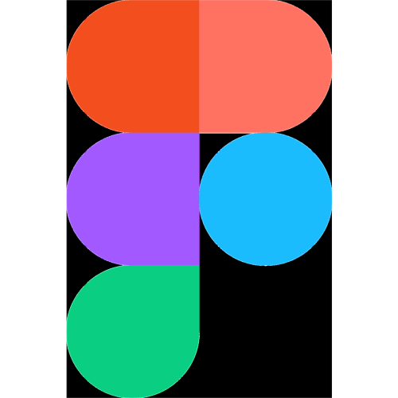

## 🚀 About Me

    

<!-- <h2 align="left">Hi 👋! My name is ... and I'm a ..., from ....</h2> -->

###

 

🎨🪵 Design tools

  
  
  
  
  
  
  

###

 
📕 Languages

  
  
  
  
  

###

 
🛠️ Technology Stack ⚙️

  

###
 

📖 Currently Learning

  
  
  
  
  
  

###

## 🔗 Links

📫 How to reach me...

  
  
  
  
  
  

###

## Badges

